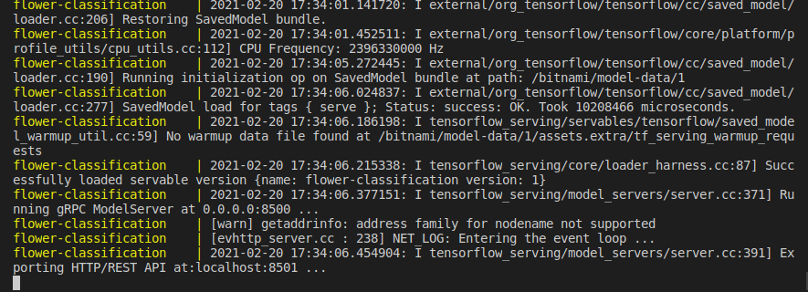
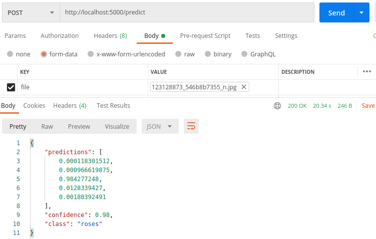

## Serving a Tensorflow model as a REST API using Tensorflow Serving and FastAPI 

## Tools used currently 
- FastAPI
- Tensorflow serving (from Bitnami Tensorflow serving image optimized for debian)
- Tensorflow 2.0
- Helper packages i.e Pillow, numpy, io, python-multipart etc.

## How to run this 

1. #### Clone/Download this repository 

2. #### Navigate to the root directory 
```
$ cd fastapi_tensorflow_serving
```

3. #### Folder structure 
**app** - Contains the main FastAPI app,
**servables** - Contains the Tensorflow SavedModel (for flower classification),
**assets** - Contains other third-party assets,
**tensorflow-model-server** - Contains configuration files for bitnami tensorflow serving image,
**images** - Contains test images.
**docker-compose.yml** - Docker compose file for running the containerized app (For the FastAPI service and tensorflow serving service).

4. #### How to run using docker-compose

- Install docker and docker-compose for your OS

- Build the services using docker-compose
```
$ docker-compose build
```

- Run/Start the services 
```
$ docker-compose up
```

- **PS:-** If the fastapi service fails to start with a `132 Exit code`, You can run it seperately in another terminal. This is due to some CPU optimization issues for tensorflow, I experienced it on my Windows OS.
```
$ cd app
$ pip install -r requirements.txt
```

```
$ python main.py
```

To ensure that the Tensorflow serving container is running properly, and the model is currently being served at PORT 8501 :- 



> Bravo!, predictions can be made to the endpoint http://localhost:8501/v1/models/flower-classification:predict, Check app/test.py for a snippet to make predictions.

Use saved_model_cli to view the required input and output for the model :- 
```
$ saved_model_cli show --dir {MODEL_EXPORT_PATH} --all
```

> Where MODEL_EXPORT_PATH = "./servables"

To test the FastAPI app in Postman at https://localhost:5000/predict, Upload the image of the flower:- 

For a `rose flower` image :- 


```
curl --location --request POST 'http://localhost:5000/predict' --form 'file=@"/C:/Users/IT/Downloads/roses1.jpg"'
```

Response/Output :- 
```
{
    "predictions": [
        0.000118301512,
        0.000966619875,
        0.984277248,
        0.0128339427,
        0.00180392491
    ],
    "confidence": 0.98,
    "class": "roses"
}
```


Great, The class indices file can be found in `assets/class-indices.json`.


